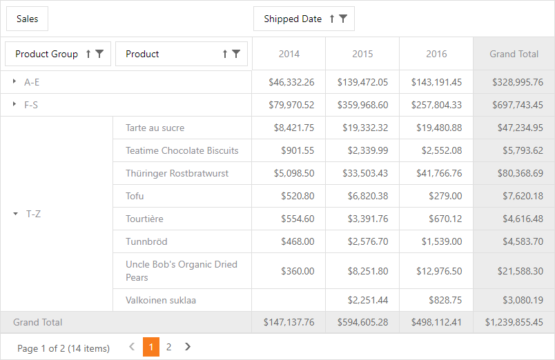

<!-- default badges list -->

<!-- default badges end -->
# Pivot Grid for Web Forms - Custom Group Intervals

The following example implements custom group intervals in the Pivot Grid to group the _Product Name_ field values into three ranges: A-E, F-S, and T-Z (according to the initial characters of the product names). The following expression is used:

`Iif(Substring([Product Name], 0, 1) < 'F', 'A-E', Substring([Product Name], 0, 1) < 'T', 'F-S', 'T-Z')`

The image below shows the result:

## Files to Review

* [Default.aspx](./CS/CustomGroupInterval/Default.aspx) (VB: [Default.aspx](./VB/CustomGroupInterval/Default.aspx))
* **[Default.aspx.cs](./CS/CustomGroupInterval/Default.aspx.cs) (VB: [Default.aspx.vb](./VB/CustomGroupInterval/Default.aspx.vb))**

## Documentation 

[Grouping](https://docs.devexpress.com/AspNet/7268/components/pivot-grid/data-shaping/grouping)

## More Examples 

[Pivot Grid for Web Forms - How to Group Date-Time Values](https://github.com/DevExpress-Examples/how-to-group-date-time-values-e1875)
